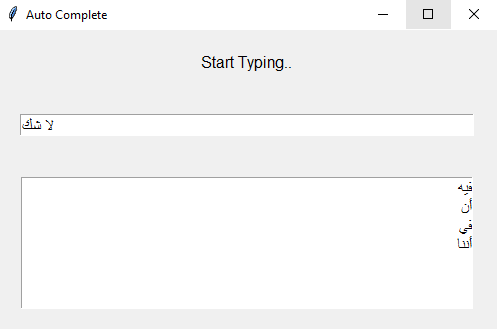
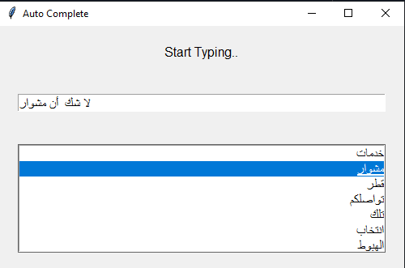

# Auto Complete Language model

Natural language processing project using trigram language model.

### Prerequisites

* You need to have any Python IDE , for example [Spyder IDE](https://www.spyder-ide.org/)  

### Installing

* 1- Make sure all files in the same folder.
* 2- Run main.py file using any python IDE.

### 📸 ScreenShots

